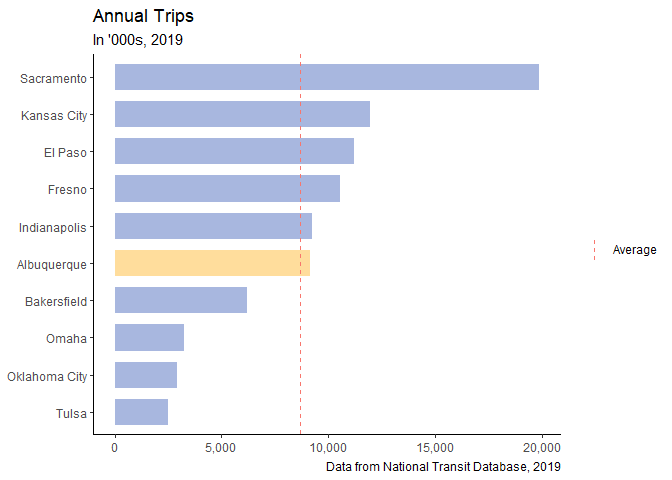
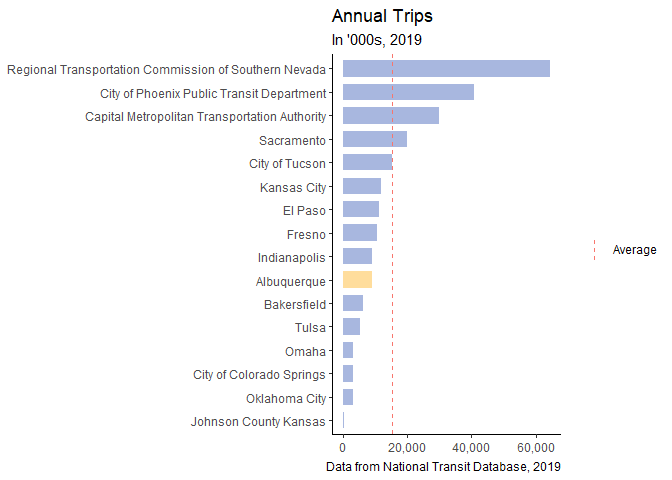
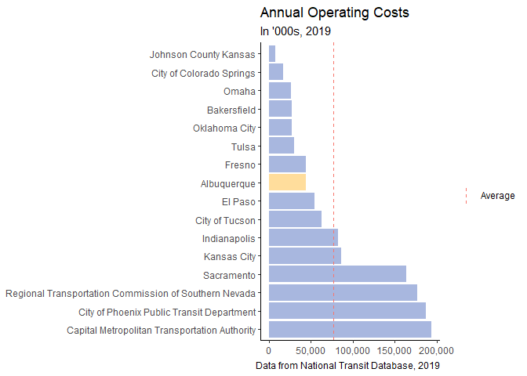
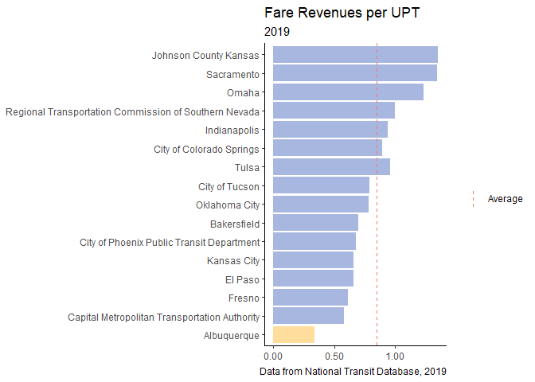

CABQ Transit Peer Review
================
Brendon Gray
May 2020 and revised June 2021

# Key Findings

  - Albuquerque transit is more efficient than many peers.

  - Fare revenues are much lower than other peer systems.

A high-level peer review was conducted to compare Albuquerque transit’s
performance relative to a group of peer systems. Performance was
evaluated during 2018.

A total of 12 comparison cites were selected. Population and geography
were used as a guide in selecting this peer group. The peer cities are:

  - Austin

  - Bakersfield

  - Colorado Springs

  - El Paso

  - Fresno

  - Indianapolis

  - Kansas City\*

  - Oklahoma City

  - Omaha

  - Sacramento\*

  - Tulsa

  - Tucson

Some cities in the comparison group are much more populous than
Albuquerque, such as Austin, Sacramento, Kansas City, and Indianapolis.
Cities with an asterisk include multiple agencies within the region. A
brief visualization comparing 12 larger systems is presented on page 6.

These statistics demonstrate Albuquerque meets or exceeds the average
performance of its peers. Albuquerque tends to have a more efficient
system than those in this peer group. The city has the third highest
riders per capita, for example. Likewise, although Albuquerque’s
operating costs and level service provision are about at the peer group
average, the city’s efficiency with respect to cost and service
provision is considerably higher than the peer group average.

This analysis is a simple representation that does not include many
factors, such as cities’ demographics. No statistic perfectly captures a
comparison between any two transit systems.

<!-- -->

# Demographics

The average service population of the peer group is about 706,000.
Albuquerque is about 40,000 less populous than the average. Austin, TX
has a population roughly twice as large as the average. Throughout the
comparison, note that Austin is an outlier in this regard. Albuquerque
is one of 5 cities in the southwest; the remaining are either on the
west coast or in the Midwest. Comparisons across geography add another
layer of complexity, as some systems have been operating for longer than
Albuquerque’s. MSA population was not included in this analysis.

# Trips

Albuquerque has a high number of unlinked passenger trips per capita,
relative to the peer group. The per capita average is 9.7. Albuquerque’s
14.6 puts it well above that average, competing with cities like El
Paso, TX and Fresno, CA.

# Service

Peers averaged 5.09 million revenue hours while Albuquerque provided
just 4.04 million. Austin is a notable outlier within the peer group;
removing that transit agency puts the peer group average at 4.36
million, just above Albuquerque. The amount of service provided and the
number of annual trips represents the system productivity. Compared to
the peer group, Albuquerque transit has high productivity. The city is
about 60% more productive than the peer group average. Note that while
the transit system in Austin offers the most number of revenue hours, it
has one of the lowest productivity scores. Trips per revenue hour is not
a perfect measure of productivity. A more accurate measure would take
into consideration other demographic factors, like service population.

# Expenses

Operating costs were measured based off the cost of operating motor bus
and demand response service only. These are the reference comparisons
with Albuquerque. The peer group averaged $38.6 million in operating
expenses in 2018. Albuquerque’s operating costs were roughly equal to
the peer average, at $42.8 million.  
As seen on the next page, Albuquerque’s $106 cost per unit of service
was above the peer group average of $83. The city’s cost effectiveness,
measured as the operating cost per trip, was $4.43, well below the
average of $5.81. Albuquerque is, again, near the peer group average
with overall operating costs and in the upper quarter with effectiveness
measures.

<!-- --><!-- --><!-- -->

# Fares

Fare revenue was compared across the peer group. Although Albuquerque
was at or above the peer group average for most of the above metrics,
Albuquerque is behind with respect to fare revenue. The city’s $3.2 m in
fare revenue is well below the $5.3 m peer group average. Comparing fare
efficiency– i.e. fares per trip – still puts Albuquerque at the bottom
of the sample. The city had the lowest fare revenues earned per trip,
coming in 64% below the average. Albuquerque’s recovery ratio – the fare
revenue earned per operating expense – was also the lowest of the peer
group. Note cities with recovery ratios above 0.150 (Colorado Springs,
Sacramento, Omaha, Bakersfield, and Tucson) have relatively low service
provision and service efficiency (page 2). This may indicate these
systems operate under a different business model, which would explain
the dramatic differences in recovery ratios.

<!-- --><!-- -->

    ##  [1] 0.1325 0.1325 0.1325 0.1325 0.1325 0.1325 0.1325 0.1325 0.1325 0.1325
    ## [11] 0.1325 0.1325

    ##       agency_name fare_revenues_per_total_operating_expense_recover_ratio
    ## 1    Indianapolis                                                    0.10
    ## 2         El Paso                                                    0.14
    ## 3   Oklahoma City                                                    0.10
    ## 4           Tulsa                                                    0.17
    ## 5     Albuquerque                                                    0.07
    ## 6           Omaha                                                    0.15
    ## 7     Kansas City                                                    0.09
    ## 8  Salt Lake City                                                    0.13
    ## 9          Denver                                                    0.19
    ## 10    Bakersfield                                                    0.16
    ## 11     Sacramento                                                    0.15
    ## 12         Fresno                                                    0.14
    ##    fare_revenues_per_unlinked_passenger_trip
    ## 1                                       0.94
    ## 2                                       0.66
    ## 3                                       0.78
    ## 4                                       0.96
    ## 5                                       0.34
    ## 6                                       1.23
    ## 7                                       0.66
    ## 8                                       0.94
    ## 9                                       1.13
    ## 10                                      0.70
    ## 11                                      1.34
    ## 12                                      0.61
    ##    avg_fare_revenues_per_total_operating_expense_recover_ratio
    ## 1                                                       0.1325
    ## 2                                                       0.1325
    ## 3                                                       0.1325
    ## 4                                                       0.1325
    ## 5                                                       0.1325
    ## 6                                                       0.1325
    ## 7                                                       0.1325
    ## 8                                                       0.1325
    ## 9                                                       0.1325
    ## 10                                                      0.1325
    ## 11                                                      0.1325
    ## 12                                                      0.1325
    ##    avg_fare_revenues_per_unlinked_passenger_trip fare_per_upt_diffs
    ## 1                                         0.8575            -0.0325
    ## 2                                         0.8575             0.0075
    ## 3                                         0.8575            -0.0325
    ## 4                                         0.8575             0.0375
    ## 5                                         0.8575            -0.0625
    ## 6                                         0.8575             0.0175
    ## 7                                         0.8575            -0.0425
    ## 8                                         0.8575            -0.0025
    ## 9                                         0.8575             0.0575
    ## 10                                        0.8575             0.0275
    ## 11                                        0.8575             0.0175
    ## 12                                        0.8575             0.0075
    ##    is_diff_negative
    ## 1     Below Average
    ## 2     Above Average
    ## 3     Below Average
    ## 4     Above Average
    ## 5     Below Average
    ## 6     Above Average
    ## 7     Below Average
    ## 8     Below Average
    ## 9     Above Average
    ## 10    Above Average
    ## 11    Above Average
    ## 12    Above Average

<!-- --><!-- -->

    ## # A tibble: 12 x 3
    ##    agency_name    tot_op_expenses avg_op_expenses
    ##    <fct>                    <dbl>           <dbl>
    ##  1 Albuquerque             44494.         100601.
    ##  2 Bakersfield             27164.         100601.
    ##  3 Denver                 411734.         100601.
    ##  4 El Paso                 54727.         100601.
    ##  5 Fresno                  44445.         100601.
    ##  6 Indianapolis            82833.         100601.
    ##  7 Kansas City             85660.         100601.
    ##  8 Oklahoma City           23218.         100601.
    ##  9 Omaha                   26326.         100601.
    ## 10 Sacramento             163163.         100601.
    ## 11 Salt Lake City         229181.         100601.
    ## 12 Tulsa                   14270.         100601.

<!-- -->

# Large Systems Comparison

A sample of large systems were selected to compare against Albuquerque’s
metrics. To simplify the comparison, three metrics were selected:
service population, annual trips, and fare efficiency. Cities in orange
have light rail service options (or the equivalent); cities in blue do
not. As expected, cities with more population tend to have light rail
service. Albuquerque has both a relatively small service population and
a lower number of annual trips provided. Note cities who service
similarly populous areas (Dallas, Portland, and Phoenix) all have below
average fare efficiency. Albuquerque has comparable fare efficiency to
this subset of systems.
