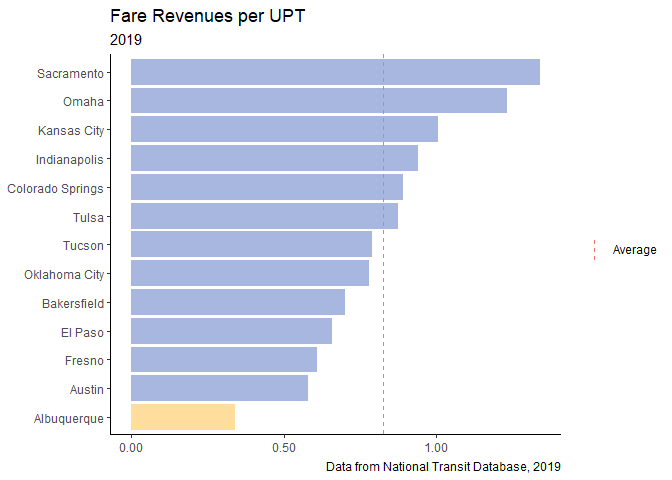

CABQ Transit Peer Review
================
Brendon Gray
May 2020 and revised June 2021

# Key Findings

**Note:** This project was designed to build on previous project
completed during an academic internship. For more background, read the
project
[explainer](https://github.com/brendongray/abqtransitdata/blob/main/README.md).

  - Albuquerque transit is more efficient than many peers.

  - Fare revenues are much lower than other peer systems.

A high-level peer review was conducted to compare Albuquerque transit’s
performance relative to a group of peer systems. Performance was
evaluated during 2019.

A total of 12 comparison cites were selected. Population and geography
were used as a guide in selecting this peer group. The peer cities are:

| Southwest        | West        | Midwest      |
| :--------------- | :---------- | :----------- |
| Austin           | Bakersfield | Kansas City  |
| Colorado Springs | Fresno      | Indianapolis |
| El Paso          | Sacramento  | Omaha        |
| Tucson           |             |              |
| Oklahoma City    |             |              |
| Tulsa            |             |              |

Some cities in the comparison group are much more populous than
Albuquerque, such as Austin, Sacramento, Kansas City, and Indianapolis.
Cities with an asterisk include multiple agencies within the region.

These statistics demonstrate Albuquerque meets or exceeds the average
performance of its peers. Albuquerque tends to have a more efficient
system than those in this peer group. Likewise, although Albuquerque’s
operating costs and level service provision are about at the peer group
average, the city’s efficiency with respect to cost and service
provision is considerably higher than the peer group average.

The average service population of the peer group is about 706,000.
Albuquerque is about 40,000 less populous than the average. Austin, TX
has a population roughly twice as large as the average. Throughout the
comparison, note that Austin is an outlier in this regard. Albuquerque
is one of 6 cities in the southwest; the remaining are either on the
west coast or in the Midwest. Comparisons across geography add another
layer of complexity, as some systems have been operating for longer than
Albuquerque’s. MSA population was not included in this analysis.

This analysis is a simple representation that does not include many
factors, such as cities’ demographics. No statistic perfectly captures a
comparison between any two transit systems.

# Trips

Albuquerque has a below average number of annual trips (9.6 million).
The peer group average is 10.8 million.

<!-- -->

# Service

Peers averaged 6.8 million revenue hours while Albuquerque provided 5.3
million. Austin is a notable outlier (16.6 million), which increases the
overall average.

<!-- -->

# Expenses

Operating costs were measured based off the cost of operating motor bus
and demand response service only. These are the reference comparisons
with Albuquerque.

The peer group averaged $63.4 million in operating expenses in 2019.
Albuquerque’s operating costs were about 50% below the average at $42.8
million.
<!-- -->

Albuquerque’s cost effectiveness (operating cost per trip) was $4.4 cost
per unit of service, below the peer group average of $5.8.

<!-- -->

The city’s cost per revenue hour was $106, below the average of $111.6.

<!-- -->
These three operating expense measures show is near the peer group
average with overall operating costs and in the upper quarter with
effectiveness measures.

# Fares

Fare revenue was compared across the peer group. Although Albuquerque
was at or above the peer group average for most of the above metrics,
Albuquerque is behind with respect to fare revenue.

The city’s $3.2 m in fare revenue is well below the $5.3 m peer group
average. Comparing fare efficiency– i.e. fares per trip – still puts
Albuquerque at the bottom of the sample. The city had the lowest fare
revenues earned per trip at $0.34, coming in 64% below the average of
$0.82.

<!-- -->

Albuquerque’s recovery ratio – the fare revenue earned per operating
expense – was also the lowest of the peer group. Albuquerque had a
recovery ratio of just 0.08. The average was 0.135 (68% higher than
Albuquerque). Note cities with recovery ratios above 0.135 (Colorado
Springs, Sacramento, Omaha, Bakersfield, and Tucson) have relatively low
service provision and service efficiency. This may indicate these
systems operate under a different business model, which would explain
the dramatic differences in recovery ratios.

<!-- -->

# Large Systems Comparison

**Note:** This section was made using a seperate data visualization
software.

A sample of large systems were selected to compare against Albuquerque’s
metrics. To simplify the comparison, three metrics were selected:
service population, annual trips, and fare efficiency. Cities in orange
have light rail service options (or the equivalent); cities in blue do
not. As expected, cities with more population tend to have light rail
service. Albuquerque has both a relatively small service population and
a lower number of annual trips provided. Note cities who service
similarly populous areas (Dallas, Portland, and Phoenix) all have below
average fare efficiency. Albuquerque has comparable fare efficiency to
this subset of systems.
